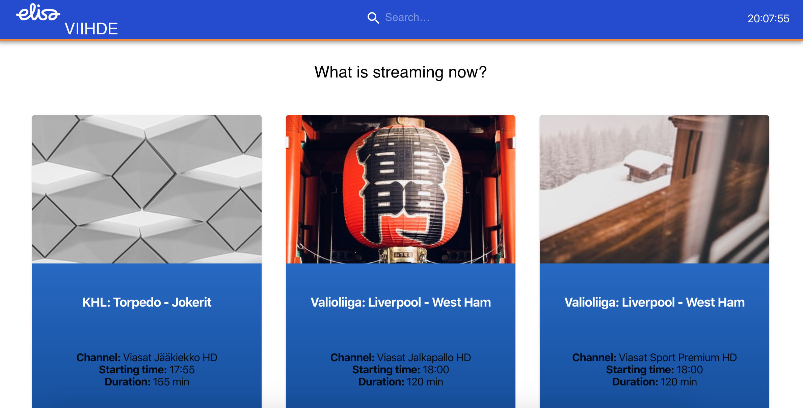

# Viihde-App

The application for cheking live programs on the Elisa Viihde service created with the use of React, Typescript, axios hooks, Material-UI and styled components.

See  in action (but give heroku a few seconds to boot the instance)!



## Development

To run the app in the development mode:

`npm start`

Open [http://localhost:3000](http://localhost:3000) to view it in the browser.

To run basic rendering test:

`npm test`

## Deployment

The delpoyment to heroku requires the installation of Git and Heroku CLI:

To deploy the app run:

```
heroku create
git push heroku master
```

## Further work

The idea of app was to show currently streaming programs with images. However, the available data didn't contain images for all the shows, so I used random pictures to demonstrate the UI.

The obvious next step would be to include more images from other endpoints. In addtion, unit tests and validation tests should be created, e.g. with jest and Robot Framework.
