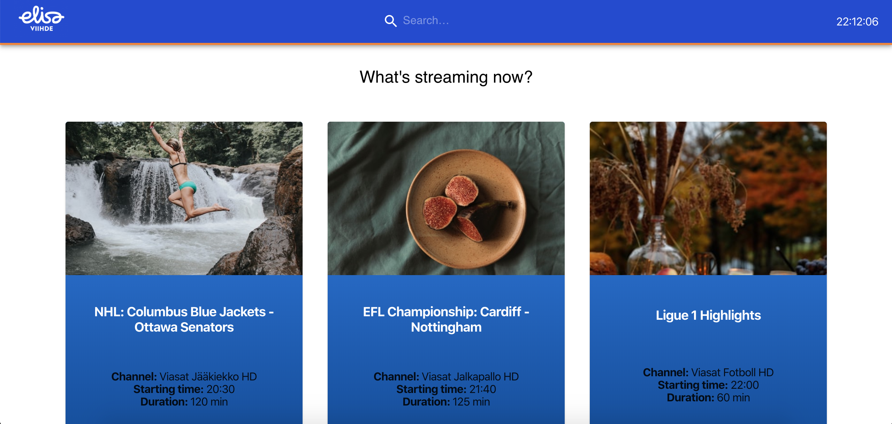

# Viihde-App

The application for cheking live programs on the Elisa Viihde service created with the use of React, Typescript and Material-UI.

## Development

`npm start`

Runs the app in the development mode. 
Open [http://localhost:3000](http://localhost:3000) to view it in the browser.

The page will reload if you make edits. 
You will also see any lint errors in the console.

## Deployment

## Further work

- image are bogus
- filter popular stuff
